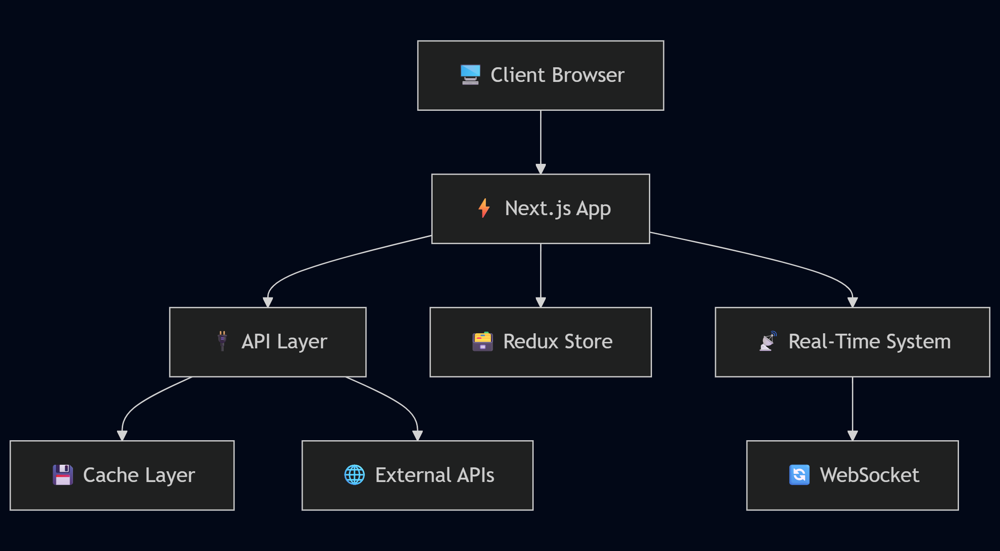
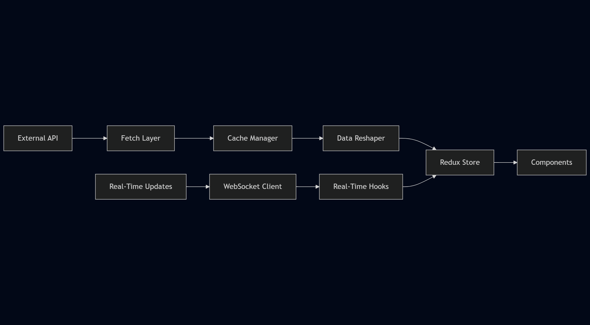
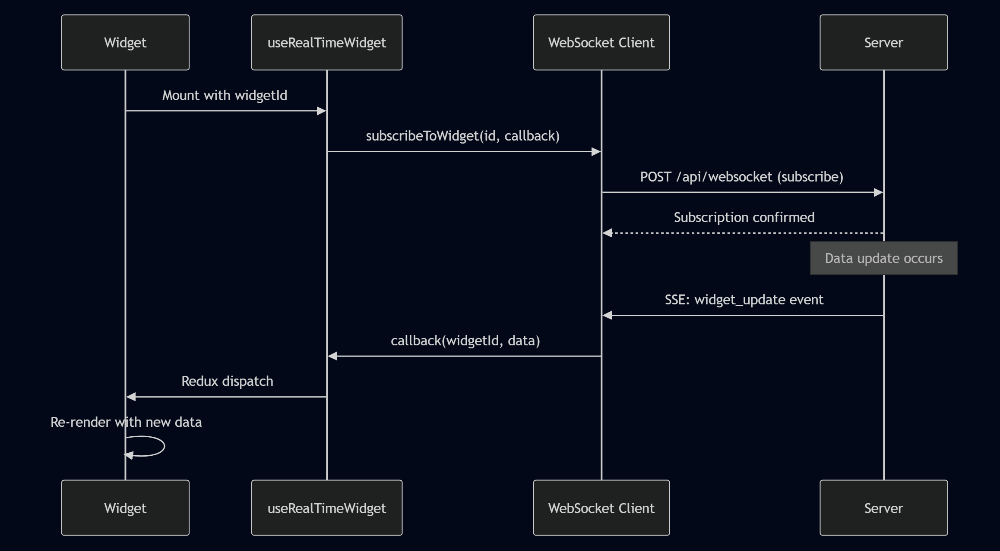
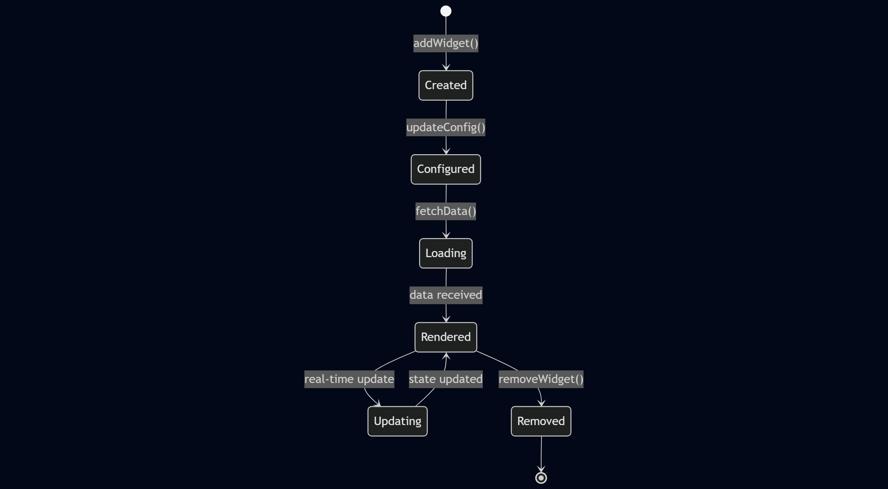

# FinBoard Architecture 🏗️

This document provides a comprehensive overview of FinBoard's system architecture, component design, and data flow patterns.

## System Overview

FinBoard follows a modern, layered architecture built on Next.js 14 with the App Router, implementing real-time data streaming and intelligent caching.



## Core Architecture Layers

### 1. Presentation Layer
**Location**: `/components/`, `/app/`

#### Component Hierarchy
```
App Layout (layout.tsx)
├── Providers (providers.tsx)
│   ├── Redux Store Provider
│   └── Theme Provider
├── Navigation Bar (navbar.tsx)
│   ├── Theme Toggle
│   ├── Real-Time Status
│   └── Dashboard Controls
└── Dashboard Grid (dashboardGrid.tsx)
    ├── Widget Renderer (widgetRenderer.tsx)
    │   ├── Widget Charts (widgetChart.tsx)
    │   ├── Widget Tables (widgetTable.tsx)
    │   └── Widget Cards (widgetCard.tsx)
    └── Widget Builder (widgetBuilder.tsx)
```

#### Component Design Principles
- **Single Responsibility**: Each component has one clear purpose
- **Composition over Inheritance**: Building complex UIs from simple components
- **Props Interface**: Strongly typed props with TypeScript
- **Memoization**: React.memo for performance optimization

### 2. State Management Layer
**Location**: `/store/`

#### Redux Store Structure
```typescript
interface RootState {
  widgets: WidgetsState;     // Widget data and configuration
  layout: LayoutState;       // Dashboard layout persistence
  dashboard: DashboardState; // UI state and settings
  theme: ThemeState;         // Theme preferences
}
```

### 3. Data Layer
**Location**: `/lib/`, `/app/api/`

#### Data Flow Architecture


#### Caching Strategy
```typescript
// Multi-level caching system
interface CacheLayer {
  memory: Map<string, CacheEntry>;     // L1: In-memory cache
  localStorage: Storage;               // L2: Browser storage
  api: CacheControlHeaders;           // L3: HTTP cache headers
}
```

## Real-Time System Architecture

### WebSocket + Polling Hybrid

FinBoard implements a robust real-time system combining WebSocket connections with intelligent polling fallback.

#### Connection Management
```typescript
class RealTimeClient {
  private eventSource: EventSource;      // Server-Sent Events
  private pollingInterval: NodeJS.Timeout; // Fallback polling
  private callbacks: Map<string, Function>; // Widget subscriptions
  
  // Hybrid approach for maximum reliability
  connect() {
    this.setupSSE();        // Primary: Server-Sent Events
    this.startPolling();    // Fallback: Regular polling
  }
}
```

#### Subscription Model


### Server-Side Event Streaming

#### API Route Design
```typescript
export async function GET(request: NextRequest) {
  // Server-Sent Events endpoint
  const stream = new ReadableStream({
    start(controller) {
      // Connection management
      // Heartbeat mechanism
      // Cleanup on disconnect
    }
  });
}

export async function POST(request: NextRequest) {
  // Subscription management
  // Widget update broadcasting
}

export async function PUT(request: NextRequest) {
  // Polling endpoint for updates
}
```

## 🎨 Widget System Architecture

### Widget Lifecycle


### Widget Configuration System
```typescript
interface DisplayConfig {
  mode: 'chart' | 'table' | 'cards';
  chart?: ChartConfig;
  table?: TableConfig;
  cards?: CardsConfig;
}

// Polymorphic widget rendering
const WidgetRenderer = ({ config, data }: WidgetProps) => {
  switch (config.mode) {
    case 'chart': return <WidgetChart config={config.chart} data={data} />;
    case 'table': return <WidgetTable config={config.table} data={data} />;
    case 'cards': return <WidgetCards config={config.cards} data={data} />;
  }
};
```

### Auto-Detection System
```typescript
// Intelligent field detection and configuration
const autoDetectDisplayMode = (data: any[]): DisplayConfig => {
  const fields = analyzeFields(data);
  
  if (hasOHLCFields(fields)) return candlestickConfig;
  if (hasTimeSeriesFields(fields)) return lineChartConfig;
  if (hasFinancialFields(fields)) return tableConfig;
  
  return defaultCardConfig;
};
```

## Performance Architecture

### Code Splitting Strategy
```typescript
// Dynamic imports for optimal bundle size
const WidgetChart = dynamic(() => import('./widgetChart'), {
  loading: () => <ChartSkeleton />,
  ssr: false // Client-side only for charts
});

const WidgetTable = dynamic(() => import('./widgetTable'), {
  loading: () => <TableSkeleton />
});
```

### Caching Strategy
```typescript
interface CacheStrategy {
  ttl: number;              // Time-to-live in milliseconds
  maxSize: number;          // Maximum cache entries
  evictionPolicy: 'LRU';    // Least Recently Used
  persistance: 'memory' | 'localStorage';
}
```

### Memoization Patterns
```typescript
// Component memoization
const WidgetCard = memo(({ data, config }) => {
  const processedData = useMemo(() => 
    processFinancialData(data), [data]
  );
  
  return <CardContent data={processedData} />;
});

// Selector memoization
const selectWidgetData = createSelector(
  [(state) => state.widgets.widgets, (_, widgetId) => widgetId],
  (widgets, widgetId) => widgets.find(w => w.id === widgetId)
);
```

## Error Handling Architecture

### Error Boundary System
```typescript
class WidgetErrorBoundary extends Component {
  static getDerivedStateFromError(error: Error) {
    return { hasError: true, error };
  }
  
  componentDidCatch(error: Error, errorInfo: ErrorInfo) {
    // Error reporting
    console.error('Widget error:', error, errorInfo);
  }
}
```

### Graceful Degradation
```typescript
// API failure handling
const fetchWithFallback = async (url: string) => {
  try {
    return await fetchFromAPI(url);
  } catch (error) {
    return await fetchFromCache(url) || getDefaultData();
  }
};
```

## Security Architecture

API gets handled as polls and are used by client side to call APIS
On the current hand - it doesnt implement a backend for user signon
Which would let implement an OAuth System for Security Architecture

Now for security - We have implemented the API test which validates api keys

## Monitoring & Observability

### Performance Monitoring
```typescript
// Built-in performance tracking
const PerformanceMonitor = {
  trackWidgetRender: (widgetId: string, duration: number) => {
  },
  
  trackAPICall: (endpoint: string, duration: number, success: boolean) => {
    // API performance tracking
  }
};
```

### Real-Time Metrics
- **Connection Status**: WebSocket health monitoring
- **Cache Hit Rate**: Caching efficiency metrics
- **Widget Load Time**: Component rendering performance
- **Memory Usage**: Client-side memory tracking

## Deployment Architecture

### Build Optimization
```json
{
  "nextConfig": {
    "experimental": {
      "appDir": true,
      "serverComponentsExternalPackages": ["chart.js"]
    },
    "compiler": {
      "removeConsole": true
    }
  }
}
```

### Production Considerations
- **Static Generation**: Pre-built dashboard shell
- **Edge Runtime**: Optimized API routes
- **CDN Integration**: Static asset optimization
- **Database Scaling**: Horizontal scaling for real-time data
